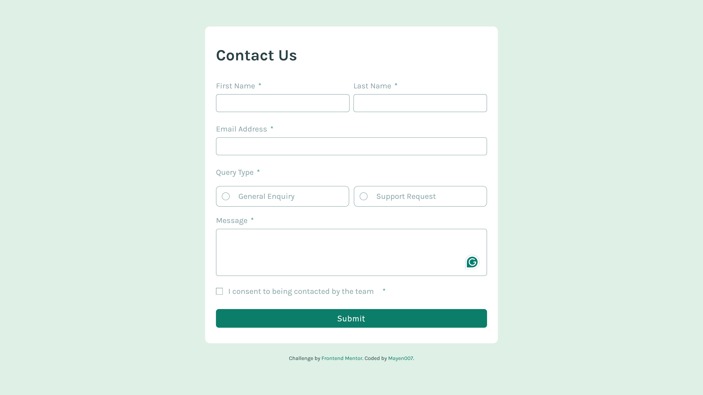

# Frontend Mentor - Contact Form Solution

This is my solution to the [Contact Form challenge on Frontend Mentor](https://www.frontendmentor.io/challenges/contact-form--G-hYlqKJj). This project demonstrates responsive form design, custom form validation, and accessibility features.

## Table of Contents

- [Overview](#overview)
  - [The Challenge](#the-challenge)
  - [Screenshots](#screenshots)
  - [Links](#links)
- [My Process](#my-process)
  - [Built With](#built-with)
  - [What I Learned](#what-i-learned)
  - [Continued Development](#continued-development)
  - [Useful Resources](#useful-resources)
- [Author](#author)

## Overview

### The Challenge

Users should be able to:

- Complete the form and see a success message upon submission.
- Receive validation error messages for:
  - Missing required fields.
  - Incorrect email format.
- Navigate the form using only a keyboard.
- Have inputs, error messages, and the success message announced on a screen reader.
- View a responsive layout optimized for both mobile and desktop.
- See hover and focus states for all interactive elements.

### Screenshots

#### Desktop View



### Links

- [Solution Repository](https://github.com/Mayen007/Contact-form)
- [Live Demo](https://mayen007.github.io/Contact-form/)

## My Process

### Built With

- Semantic HTML5
- CSS custom properties
- Flexbox for layout
- Mobile-first workflow
- Custom form validation and ARIA roles for accessibility
- CSS grid for structuring name inputs

### What I Learned

#### Styling Focus States:

```css
input:focus,
textarea:focus {
  outline: none;
  border: 2px solid var(--green-600);
}
```

#### Error Handling and Validation:

CSS for displaying error messages:

```css
.error-message {
  font-size: 12px;
  color: var(--red);
  display: none;
}
.input-error {
  border: 1px solid var(--red);
}
```

### Accessible Form Validation:

```html
<div role="alert" aria-live="polite" class="confirmation-message">
  <h4>
     Message Sent!
  </h4>
</div>
```

### Continued Development

In future projects, I aim to:

- Refine JavaScript form validation.
- Deepen my understanding of ARIA roles and how they interact with assistive technologies.
- Experiment with animations for success/error messages.

### Useful Resources

- [MDN Web Docs: Form Validation](https://developer.mozilla.org/en-US/docs/Learn/Forms/Form_validation) - Great for understanding custom form validations.
- [A11y Project](https://www.a11yproject.com/) - Helped with improving accessibility.

## Author

- GitHub - [Mayen007](https://www.github.com/Mayen007)
- Frontend Mentor - [@Mayen007](https://www.frontendmentor.io/profile/Mayen007)
